This post is the second in a 2 part series:

1. Part 1: [Introduction to Linux Netkit interfaces]().
2. Part 2: Creating a Linux “Yogurt-phone” — with netkit and a grain of eBPF (This post)

A “Yogurt-phone” is a simple children science experiment where young experimenters connect two phones through a thread or wire.
They can then talk together using the Yogurt pots as ends of a phone line. This is nice introduction to communication over a
wire — literally.

After building a successful “Hello World” equivalent of Netkit interfaces with eBPF
[in the previous post](()), I wondered how I could build an
equivalent of this “Yogurt-phone”, connecting two Netkit interface pairs in their own namespaces over an eBPF “wire”.

In this post, I will try to show how this could be built, what are the limitations and how to navigate in the scarce eBPF
documentation.

If you are not yet familiar with Linux’s Netkit network interfaces, I highly encourage you to read the first part first.

The full code for this post [is available in this Gist](https://gist.github.com/yadutaf/cdb3f6ceafa0154c59884f9aabf4106c). This
Gist includes the Go part as well as a dynamic interface discovery that are not detailed in this post.


### Goal

My goal here will be to enable point to point communication between two network namespaces “Yogurts” on the same host using only
two pairs of netkit interfaces and eBPF as the wire. The network packets will not leave the host, and most notably, they will
not travel through a physical network interface. Finally, user land applications on the host’s main network namespace should
not be able to interfere with the “Yogurt-phone”.

The end result should essentially look like the following schematic:

```mermaid
---
config:
  theme: neutral
  layout: elk
  look: handDrawn
  themeCSS: '.label p { padding: 0 .25em 0 .25em; }'
---
flowchart LR
  subgraph yogurt-1
    yg1-cont["yg1-cont<br/><small><code>10.42.0.1/24</code></small>"]
  end
  subgraph yogurt-2
    yg2-cont["yg2-cont<br/><small><code>10.42.0.2/24</code></small>"]
  end
  subgraph host["**Host**"]
    host-apps["tcpdump, ping, ..."]
    yogurt-1
    yogurt-2
    yg1-host["yg1-host"]
    yg2-host["yg2-host"]
  end

  yg1-cont --- yg1-host
  yg1-host <== 🐝 eBPF ==> yg2-host
  yg2-host --- yg2-cont
  host-apps -. ❌ .-> yg2-host
  host-apps@{ shape: text}
```



Two network namespaces respectively named `yogurt-1` and `yogurt-2` have their own netkit interface pairs. An eBPF program
ensures the communication between the “Yogurts”. Also, ideally, user space applications on the host should not be able to
interfere (eavesdrop or communicate). Ideally…

### Lab setup

The setup is pretty straightforward. We first need to create the two network namespaces using the `ip netns add` command and
then create the two netkit interface pairs in black hole mode, this time using the `ip link add` command. Finally, we can
attribute ann IP address and bring each interface up. Aside from the “netkit name” and the “blackhole” policy, this should
sound very familiar if you have ever worked with veth pairs before.

This can easily be done with a script like this one:

```bash
#!/bin/bash
set -euo pipefail

for i in {1..2}
do
    NETNS="yogurt-${i}"
    IFNAME_PREFIX="yg${i}"

    echo "➡️  Creating netns ${NETNS}..."

    # Reset the network namespace
    mountpoint -q "/run/netns/${NETNS}" && sudo ip netns del "${NETNS}"
    sudo ip netns add "${NETNS}"

    # Create and setup the interface pair with both sides in blackhole mode
    sudo ip link add "${IFNAME_PREFIX}-host" type netkit blackhole peer blackhole name "${IFNAME_PREFIX}-cont"
    sudo ip link set "${IFNAME_PREFIX}-cont" netns "${NETNS}"
    sudo ip netns exec "${NETNS}" ip addr add "10.42.0.${i}/24" dev "${IFNAME_PREFIX}-cont"
    sudo ip netns exec "${NETNS}" ip link set lo up
    sudo ip netns exec "${NETNS}" ip link set "${IFNAME_PREFIX}-cont" up
    sudo ip link set "${IFNAME_PREFIX}-host" up
done

echo "All done ✅"
```

### Now what?

That literally was my state of mind while working on the proof of concept that became the reason for being of this
post. I could not find any documentation nor examples anywhere, not even in the Kernel’s self tests.

Fortunately, there is this [presentation from LPC networking in 2023](https://lpc.events/event/17/contributions/1581/attachments/1292/2602/lpc_netkit_devs.pdf)
by Daniel Borkmann who works for Isovalent. This presentation explains the context and the rational behind the netkit interfaces
as well as the main design decisions. For example, we learn that we need `bpf_redirect_peer()` to forward a packet from a physical
interface to the netkit interface in a container. Similarly, we need `bpf_redirect_neigh()` on the way out, so that the proper
L2 headers are prepended to the packet.

Spoiler, these are not the appropriate calls for the yogurt to yog… sorry, the netns to netns use-case I was looking for.
Luckily, there it is, hidden in the “netkit: Ongoing work” slide: we have to use the older `bpf_redirect()` call.


Great!

Wait, wait… How are we supposed to use it? Which hook? What arguments from the peer hook to the peer interface? Or should
it be partly on the primary interface? Where exactly are the packets supposed to flow?

I suppose we are going to need to experiment to find our answers.

### Reverse engineering the netns-to-netns use case

First and foremost, we need some tooling. We’ll need some signal generation, and probes to monitor how the system reacts and
behaves.

For the signal, we can use a simple `ping`. This will periodically send predictable probe packets to our circuit.

For probing, there are two important things to observe:

1. Which eBPF hook is triggered, and how are the relevant flags set in the `sk_buff`?
2. On Which netkit interface does the packet materialize?

For the first one, to trace the activated eBPF hook, we’ll use a combination of `bpf_printk()` and
`cat /sys/kernel/tracing/trace` to respectively generate and observe the trace. After studying
[`struct __sk_buff`](https://docs.ebpf.io/linux/program-context/__sk_buff/), we can make an educated guess
that logging the `ifindex` and `ingress_ifindex` fields might be a good start choice.

For the second one, to spot on which interface the packet actually materializes, we can use a good old
`tcpdump`. Four of them actually, one for each netkit interface.

If you want to practice these yourself, here is a summary of the “probe” and “trace” commands:

```bash
# Generate the test pings from the first "Yogurt"
sudo ip netns exec yogurt-1 ping 10.42.0.2

# Fire the 4 tcpdump instances, for each interface
sudo ip netns exec yogurt-1 tcpdump -vnli yg1-cont icmp
sudo ip netns exec yogurt-2 tcpdump -vnli yg2-cont icmp
sudo tcpdump -vnli yg1-host icmp
sudo tcpdump -vnli yg2-host icmp

# Clear / Dump the eBPF trace buffer
echo "" | sudo tee /sys/kernel/tracing/trace
sudo cat /sys/kernel/tracing/trace
```

Last but not least, we need an initial eBPF program to at least generate some traces. I’ll intentionally
start with a program that drops every packet, and we’ll then progressively add code to direct the packets
and check how the system reacts.

To avoid making this blog post too long, I’ll skip the go boilerplate to load the program. If it helps,
there is a good starting point in the previous post on this blog.

Here is the initial, but fully functional, eBPF program:

```c {hl_lines=[11, 17]}
//go:build ignore

#include <linux/bpf.h>
#include <linux/if_link.h>
#include <bpf/bpf_helpers.h>

char LICENSE[] SEC("license") = "GPL";

SEC("netkit/primary")
int netkit_primary(struct __sk_buff *skb) {
    bpf_printk("[primary] pkt with ifindex=%d, ingress_ifindex=%d", skb->ifindex, skb->ingress_ifindex);
    return NETKIT_DROP;
}

SEC("netkit/peer")
int netkit_peer(struct __sk_buff *skb) {
    bpf_printk("[peer] pkt with ifindex=%d, ingress_ifindex=%d", skb->ifindex, skb->ingress_ifindex);
    return NETKIT_DROP;
}
```

This is as simple as it can get. One function for the primary interface, a second one for the peer
interface. Each of the function only do a single thing: Trace and drop.

Believe it or not, the hard part is over. Now that we have full observability, this is only a matter
of observing and iterating.

Time for the first observation: As expected, only the tcpdump instance in the first container reports
the ping:

```
23:01:17.762228 IP (tos 0x0, ttl 64, id 32744, offset 0, flags [DF], proto ICMP (1), length 84)
    10.42.0.1 > 10.42.0.2: ICMP echo request, id 32947, seq 1, length 64
```

But, where it gets interesting, is in the trace buffer:

```
ping-225071  [014] b..1. 695823.006037: bpf_trace_printk: [peer] pkt with ifindex=47, ingress_ifindex=0
```

This is very interesting! We see that:

* The peer hook is triggered
* The interface index is 47
* The ingress interface index field is not set

Triggering the peer hook is rather expected. The unexpected part is the interface index. On my machine,
at the time of writing, 47 happens to be the interface index of the *host* interface, not the peer one.
While surprising, this makes complete sense when thinking about it. The programs are both attached to
the host side interface, with only a differing attachment part. This is a key feature of netkit interfaces,
it ensures that these interfaces can be easily managed from the host while guaranteeing that the container
side will not be able to mess up with them. Security.

### Getting the packets to flow

We now know where the ping packet initially materializes along with its interface ID. We also know from the
slides that we have to use `bpf_redirect()` in the netns to netns use case. The only unknown so far is the
ID of the target interface. Netkit interfaces can be a bit strange, with the packet on the peer interface
carrying the ID of the host interface for instance.

Since our goal is to enable “Yogurt” to “Yogurt” communication, let’s try with the ID of the `yg2-cont`
interface, 48 in my case.

Here is an updated code sample (without the initial boilerplate):

```c {lineNoStart=9, hl_lines=["11-14"]}
SEC("netkit/primary")
int netkit_primary(struct __sk_buff *skb) {
    bpf_printk("[primary] pkt with ifindex=%d, ingress_ifindex=%d", skb->ifindex, skb->ingress_ifindex);
    return NETKIT_DROP;
}

SEC("netkit/peer")
int netkit_peer(struct __sk_buff *skb) {
    bpf_printk("[peer] pkt with ifindex=%d, ingress_ifindex=%d", skb->ifindex, skb->ingress_ifindex);

    if (skb->ifindex == 47) {
        bpf_redirect(48, 0);
        return NETKIT_REDIRECT;
    }

    return NETKIT_DROP;
}
```

The highlighted block checks the source interface ID. If the packets come from the container interface side,
then we request a direction to the container side of the other container. Trivial.

Compile, execute, monitor and… Nothing changes.

Let’s change the code and try again with the host side ID this time, 49 in my case.

Immediately, the ICMP packet starts materializing on the host interface and the traces now show evidence of
the packet hitting the eBPF hook on the primary interface:

```
ping-229555  [002] b..1. 776639.442198: bpf_trace_printk: [peer] pkt with ifindex=47, ingress_ifindex=0
ping-229555  [002] b..1. 776639.442207: bpf_trace_printk: [primary] pkt with ifindex=48, ingress_ifindex=0
```

We are definitely making progress! Here we observe that:

* The _peer_ eBPF hook is still triggered with no change, as expected.
* The _primary_ interface hook is now triggered with the interface ID of… the peer interface of the
  second container 🙃
* The `ingress_ifindex` field remains useless

Equipped with this new observation, we can now add some code to allow the packet to flow from the primary
to the peer interface. This is known territory, we have already done just that in the previous post. We can
also stop logging the `ingress_ifindex` field since it apparently does not bring any value in our case.
Here is the updated primary hook:


```c {lineNoStart=9, hl_lines=["5-7"]}
SEC("netkit/primary")
int netkit_primary(struct __sk_buff *skb) {
    bpf_printk("[primary] pkt with ifindex=%d, ingress_ifindex=%d", skb->ifindex, skb->ingress_ifindex);

    if (skb->ifindex == 48) {
        return NETKIT_PASS;
    }

    return NETKIT_DROP;
}
```

And Tadaa! The ICMP echo request now materializes on the container side of the second Yogurt. `tcpdump`
even shows the ICMP echo reply starting its journey back the first container. Of course, it is blocked,
but we can easily trace the way by applying exactly the same logic in reverse. Here is the full eBPF code:

```c
//go:build ignore

#include <linux/bpf.h>
#include <linux/if_link.h>
#include <bpf/bpf_helpers.h>

char LICENSE[] SEC("license") = "GPL";

SEC("netkit/primary")
int netkit_primary(struct __sk_buff *skb) {
    if (skb->ifindex == 46 || skb->ifindex == 48) {
        return NETKIT_PASS;
    }

    return NETKIT_DROP;
}

SEC("netkit/peer")
int netkit_peer(struct __sk_buff *skb) {
    if (skb->ifindex == 47) {
        bpf_redirect(49, 0);
        return NETKIT_REDIRECT;
    }

    if (skb->ifindex == 49) {
        bpf_redirect(47, 0);
        return NETKIT_REDIRECT;
    }

    return NETKIT_DROP;
}
```

31 lines of eBPF. Yes, that’s all it takes to make an eBPF/Netkit “Yogurt-Phone”.

### Can we avoid getting through the host?

The short answer is no, or at least not yet. It also turns out that this is mentioned in the
very slide 33 that I included earlier in this post:

> Just that for veth bpf_redirect_peer (ingress->ingress) is needed whereas netkit bpf_redirect (egress->egress)

I just only understood this sentence after experimenting.

Here is what I learned along the way, peeking at Linux’s source code. These are my current understanding,
some parts may be a bit sketchy or plain wrong. You’ve been warned.

First, why isn’t it possible to `bpf_redirect()` to the peer interface?

When the eBPF programs calls [`bpf_redirect()`](https://elixir.bootlin.com/linux/v6.14.11/source/net/core/filter.c#L2524-L2535),
the function registers the *intent*: It sets a flag in the context with the target interface ID
and a flag. The actual redirection occurs after the program has returned `NETKIT_REDIRECT`.

When the program returns `NETKIT_REDIRECT`, the [interface driver calls](https://elixir.bootlin.com/linux/v6.14.11/source/drivers/net/netkit.c#L117)
`skb_do_redirect()` to perform the actual redirect. `skb_do_redirect()`
[starts by loading the `struct net`](https://elixir.bootlin.com/linux/v6.14.11/source/net/core/filter.c#L2493-L2497)
(the netns structure) and attempts to fetch the target `struct net_device` (the network interface structure).
In the context of our eBPF program, the netns is the host’s namespace. If the target interface is in the peer
namespace, the function fails to load the interface and has no choice but to drop the packet.

If you are still reading this post at this point (thanks!), you may have noticed in the code of `skb_do_redirect()`
that, right after the loading the device structure, it checks for the `BPF_F_PEER` flag. Internally this flag is
set when calling `bpf_redirect_`*`peer`*`()` instead of `bpf_redirect()`. In this case, no problem, we just need
to call this function with the ID of the host side interface, and
[it will magically load the peer interface](https://elixir.bootlin.com/linux/v6.14.11/source/net/core/filter.c#L2502-L2514).
Except that, the first line in this code block checks for `skb_at_tc_ingress()` and there are two problems with that.
First, the code in a netkit hook, not a `tc` one. Second, remember the quote from slide 33? We are on the *egress*
and not the *ingress* path. Here lies the second reason why we can’t redirect directly to the peer.

As a third option, maybe this is not too bad, or we can mitigate this, somehow?

As long as the root user is reasonably trusted on the host (we generally have a bigger issue to tackle when this
is not the case) AND there is no IP address / route to any of the host side interface, we should be reasonably fine.
However, if any of these stops to be true:

* A root use can fire a `tcpdump` instance or inject packets directly on the host side interface. In fact, at least
  for the tcpdump part, this is precisely how this post was written.
* If an IP address or route directs packets to the host side interface, a regular user can initiate communications
  with the “Yogurt” netns. Indeed, the primary hook in the final program unconditionally forwards packets to the peer
  as long as they appear on the host interface.

Limiting actions a root user can take is beyond the scope of this post (eBPF LSMs anyone?). However, maybe
we can do something about direct host/netns communication? At least, we could try.

### Blocking host to container communication

There are two main ways to look at the problem to remain as close as possible to the initial “Yogurt-Phone” metaphor:

1. Block unwanted traffic
2. Only allow traffic from the other container

Choosing between these approach is only a matter of feasibility. Of course, I picked the wrong options first. Here is
what I tried and what I learned along the way.

Let’s start by my initial ideas:

1. Filter based on the IP address(es)
2. Identify the netns from the `skb` and check if this is the root netns
3. Place a `mark` on the packet as a “magic” value and let the packet go

The first idea raws inspiration from good old firewall rules. It would work but would have several drawbacks. We have
to set up a configuration mechanism to pass a list of authorized/forbidden IP addresses. We would also need to parse
the packet to extract addresses information. All it all, it increases complexity significantly and requires pulling
data for the IP layer while the full program could/should work with only interface layer data.

The second option accidentally works, but I only realized it when writing these lines. So I’ll be honest in this
paragraph and then pretend it did not work so that I can continue make this post even longer 😜. My initial idea
was to use `BPF_CORE_READ(task, nsproxy, net_ns)` to fetch the pointer to the netns internal struct and compare it
to the pointer of the root namespace struct, which I could not find. That’s the part that did not work. That’s also
a costly read operation that happens to be the wrong way of doing. Instead, what I could and should have used is
`bpf_get_netns_cookie(skb)`. This call returns a “cookie” uniquely identifying the netns (and no, it is not a
pointer to the `struct net`, there is a dedicated, lazily allocated, `net_cookie` field). This cookie happens to
be precisely 1 on the root namespace so that we could use it as a “Well Known” value to discriminate the initial
namespace, without even needing a discovery or configuration mechanism. At least, this is what the code suggests.
This is not documented anywhere. Thus, I’ll assume with all the bad faith I can, that this is option is also doomed
and that this post can therefore continue to get longer. Sorry.

The third option also fails, but it gets interesting, and it will set the stage for a way of doing that, surprisingly,
works. The idea is to write `skb->mark` from the eBPF program. When the packet is produced from one of the “Yogurt”,
the program would place a mark on the packet to identify it as legitimate. The eBPF program on the primary interface
would just check for this mark to decide whether the packet should pass or be shot.

This solution would be very pleasing because it also simplifies the primary hook which would no longer need to check
the `ifindex`. If it’s so good, where does it fail? There are two issues, a minor and a roadblock.

The minor issue is that the `mark` can also be written from user space, typically as an iptables action or via a
`setsockopt()`, `SO_MARK` operation (as root).

The road block is that the mark unfortunately does not persist between the peer and the primary hook. It is
[“scrubed” in `netkit_xnet()`](https://elixir.bootlin.com/linux/v6.14.11/source/drivers/net/netkit.c#L57).
Weeeeel, the acute reader might argue that this behavior can be disabled since commit
[83134ef4609388f6b9ca31a384f531155196c2a7](https://git.kernel.org/pub/scm/linux/kernel/git/torvalds/linux.git/commit/?id=83134ef4609388f6b9ca31a384f531155196c2a7)
published almost 1 year ago, the corresponding iproute2 option has unfortunately not reached a stable
Ubuntu release (it will be in 25.10 though).

Out of curiosity (despair?), I checked the `__sk_buff` page of the docs.ebpf.io for the thousands time when
my eyes got caught by a member name that meant nothing. [It was called “cb”](https://docs.ebpf.io/linux/program-context/__sk_buff/#cb).
Let me quote the doc:

> This field is an array of 5 u32 values with no pre-defined meaning. Network subsystems and eBPF programs can
> read from and write to this field to share information associated with the socket buffer across programs and
> subsystem boundaries.

Eureka! 🎉

Let’s rewrite the eBPF program and produce some more logs to make sure all works fine. The lines highlighted in
the listing below corresponds to the code responsible for the “magic” mark. You may also notice a slight refactoring
in the “peer” program. This re-organization is only here to satisfy the almighty eBPF verifier who did not deem
a previous version where `cb[1]` was updated independently for both possible source interfaces to its liking.

Here is the full listing. I promise that, aside from the debug `bpf_printk(...)` line, this is the final version
(for this post):

```c {hl_lines="9 15-19 37-38"}
//go:build ignore

#include <linux/bpf.h>
#include <linux/if_link.h>
#include <bpf/bpf_helpers.h>

char LICENSE[] SEC("license") = "GPL";

const __u8 magic_redirect_seen = 0x42;

SEC("netkit/primary")
int netkit_primary(struct __sk_buff *skb) {
    bpf_printk("skb->cb: [0x%02x, 0x%02x, 0x%02x, 0x%02x, 0x%02x]", skb->cb[0], skb->cb[1], skb->cb[2], skb->cb[3], skb->cb[4]);

    // Let the packet flow, if, and only if, it has been seen by the peer
    if (skb->cb[0] == magic_redirect_seen) {
        skb->cb[0] = 0;
        return NETKIT_PASS;
    }

    return NETKIT_DROP;
}

SEC("netkit/peer")
int netkit_peer(struct __sk_buff *skb) {
    __u32 target_interface = 0;

    // Route the packet
    if (skb->ifindex == 47) {
        target_interface = 49;
    } else if (skb->ifindex == 49) {
        target_interface = 47;
    } else {
        return NETKIT_DROP;
    }

    // Mark the packet as seen, so that the primary interface knows to forward it
    skb->cb[0] = magic_redirect_seen;

    // Instruct to kernel to redirect the packet once we're done
    bpf_redirect(target_interface, 0);
    return NETKIT_REDIRECT;
}
```

Let’s test it with a ping. All works!

What about the logs?

```
ping-482962  [015] b.s3. 952915.862305: bpf_trace_printk: skb->cb: [0x42, 0x00, 0x00, 0x00, 0x00]
```

Nice, all is fine. We see our magic signature and nothing more. That’s perfect.

Now, let’s retry to inject a packet as non-root from the host with a ping. Aside from a long timeout,
nothing unexpected, the packet does not go through as it does not have a mark. We see a couple of
retries, but I will not dig into them for now:

```
ping-484403  [012] b..1. 953063.174558: bpf_trace_printk: skb->cb: [0x00, 0x00, 0x00, 0x00, 0x00]
ping-484403  [012] b..1. 953064.175961: bpf_trace_printk: skb->cb: [0x00, 0x00, 0x00, 0x00, 0x00]
ping-484403  [002] b..1. 953065.176910: bpf_trace_printk: skb->cb: [0x00, 0x00, 0x00, 0x00, 0x00]
...
```

Looks like the perfect solution. Or is it?

### TCP enters the room

Let’s try to replace our ping based test by a netcat based variant. We’ll place a client in “Yogurt 1”,
a server in “Yogurt 2” and check what we see.

```
# Start the server
sudo ip netns exec yogurt-2 nc -vln 4242

# Start the client
sudo ip netns exec yogurt-1 nc -v 10.42.0.2 4242
```

We can then send some manual “ping-pong” 🏓 to exercise the connection.

Good news is, the connection succeeds, and we can communicate just as one would expect. What about the traces?

```
# TCP Handshake
nc-535106  [014] b..1. 1122435.243010: bpf_trace_printk: skb->cb: [0x42, 0x00, 0x00, 0x00, 0x00]
nc-535106  [014] b.s2. 1122435.243053: bpf_trace_printk: skb->cb: [0x42, 0x12, 0x00, 0x00, 0x00]
nc-535106  [014] b..1. 1122435.243068: bpf_trace_printk: skb->cb: [0x42, 0x00, 0x00, 0x00, 0x00]

# Sending "ping" from yogurt-1 to yogurt-2
nc-535106  [014] b..1. 1122450.824808: bpf_trace_printk: skb->cb: [0x42, 0x00, 0x00, 0x00, 0x00]
nc-535106  [014] b.s3. 1122450.824844: bpf_trace_printk: skb->cb: [0x42, 0x00, 0x00, 0x00, 0x00]

# Sending "pong" from yogurt-2 to yogurt-1
nc-534942  [013] b..1. 1122461.696762: bpf_trace_printk: skb->cb: [0x42, 0x00, 0x00, 0x00, 0x00]
nc-534942  [013] b.s3. 1122461.696808: bpf_trace_printk: skb->cb: [0x42, 0x00, 0x00, 0x00, 0x00]
```

Oh no! What is this `0x12` in `cb[1]`?

The acute reader might realize that the “bonus” 0x12 is in the SYN+ACK packet, the second of the TCP
handshake. After some diving in tcpdump and the kernel source code, I realized that this 0x12
is precisely the *value of the TCP flags field for a SYN+ACK*.

Here is the corresponding packet in tcpdump:

```
21:21:38.784435 IP (tos 0x0, ttl 64, id 0, offset 0, flags [DF], proto TCP (6), length 60)
    10.42.0.2.4242 > 10.42.0.1.51016: Flags [S.], cksum 0x1485 (incorrect -> 0x3ed2), seq 2934304327, ack 1767656229, win 65160, options [mss 1460,sackOK,TS val 1544854307 ecr 401980807,nop,wscale 7], length 0
	0x0000:  4500 003c 0000 4000 4006 2666 0a2a 0002  E..<..@.@.&f.*..
	0x0010:  0a2a 0001 1092 c748 aee5 ee47 695c 4b25  .*.....H...Gi\K%
	0x0020:  a012 fe88 1485 0000 0204 05b4 0402 080a  ................
	0x0030:  5c14 9b23 17f5 bd87 0103 0307            \..#........
```

Oh, oh! Here it is, offset 0x21, our only possible occurrence of `0x12`. Subtracting the 20 bytes of the IPv4, this byte
is at offset 13. Precisely the offset of the TCP flags (I checked).

Surely, this can’t be a coincidence. Can we corroborate this with the source of truth, the source code?

Well, yes, [in `net/ipv4/tcp_output.c`, in `tcp_make_synack()`](https://elixir.bootlin.com/linux/v6.14.11/source/net/ipv4/tcp_output.c#L3810):

```c
TCP_SKB_CB(skb)->tcp_flags = TCPHDR_SYN | TCPHDR_ACK;
```

Ouch, maybe this is important, and we should refrain from writing there? Maybe it is, but I would rather think this is
a bug / leak. As to whether it is safe, the code in `net/core/filter.c` and `include/linux/filter.h` has all the plumbing
to save, detect write access and restore the `cb` buffer. If it happens to be unsafe, that would be a bug.

OK, so, maybe, all in all, we have valid “Yogurt Phone” 😌

### Conclusion

This journey was… unexpected. But it was a nice one. We started from a simple goal - learning how to use
netkit interfaces on the same host - and ended up deep diving into the Linux kernel source code and gotchas
and, in the end, learning far more about Linux, eBPF and netkit interface that we could have expected.

We learned how to connect two netkit pairs on the same host, that we have to go through the host side interface
but that we can efficiently ensure that only the expected packet flow by privately marking them using the “`cb`”
field. Speaking of the `cb` field, we learned that this field exposes a 5 byte subset of a much larger kernel private
field and that it (should be) safe to use it in eBPF as the kernel will save/restore it if written to. We also
saw in the process that the netkit code “scrubs” the packets when moved from one side of the pair to the other
and that the user space should soon be ready to control whether we want this scrub to happen or if we’d
rather preserve the mark.

All in all, if I could make a whish to the Kernel dev’s (beside the doc), it would be to enable peer to peer
communication, without going through the host. But hey, if it was possible, would this post exist?
