A "Yogurt-phone" is a simple children science experiment where young experimenters connect two phones through a thread or wire.
They can then talk together using the Yogurt pots as ends of a phone line. This is nice introduction to communication over a
wire — literally.

After building a successful "Hello World" equivalent of Netkit interfaces with eBPF, I wondered how I could build an equivalent
of this "Yogurt-phone", connecting two Netkit interface pairs in their own namespaces over an eBPF "wire".

This post is a followup on the previous post, [Introduction to Linux Netkit interfaces]().
If you are not yet familiar with Linux's Netkit network interfaces, I highly encourage you to read it first.

I will try to show how this could be built, what are the limitations and how to navigate in the scarce eBPF documentation.

### Goal

My goal here will be to enable point to point communication between two network namespaces "Yogurts" on the same host using only
two pairs of netkit interfaces and eBPF as the wire. The network packets will not leave the host, and most notably, they will
not travel through a physical network interface. Finally, user land applications on the host's main network namespace should
not be able to interfere with the "Yogurt-phone".

The end result should essentially look like the following schematic:

```mermaid
---
config:
  theme: neutral
  layout: elk
  look: handDrawn
  themeCSS: '.label p { padding: 0 .25em 0 .25em; }'
---
flowchart LR
  subgraph yogurt-1
    yg1-cont["yg1-cont<br/><small><code>10.42.0.1/24</code></small>"]
  end
  subgraph yogurt-2
    yg2-cont["yg2-cont<br/><small><code>10.42.0.2/24</code></small>"]
  end
  subgraph host["**Host**"]
    host-apps["tcpdump, ping, ..."]
    yogurt-1
    yogurt-2
    yg1-host["yg1-host"]
    yg2-host["yg2-host"]
  end

  yg1-cont --- yg1-host
  yg1-host <== 🐝 eBPF ==> yg2-host
  yg2-host --- yg2-cont
  host-apps -. ❌ .-> yg2-host
  host-apps@{ shape: text}
```



Two network namespaces respectively named `yogurt-1` and `yogurt-2` have their own netkit interface pairs. An eBPF program
ensures the communication between the "Yogurts". Also, ideally, user space applications on the host should not be able to
interfere (eavesdrop or communicate). Ideally...

### Lab setup

The setup is pretty straightforward. We first need to create the two network namespaces using the `ip netns add` command and
then create the two netkit interface pairs in blackhole mode, this time using the `ip link add` command. Finally, we can
attribute ann IP address and bring each interface up. Aside from the "netkit name" and the "blackhole" policy, this should
sound very familiar if you have ever worked with veth pairs before.

This can easily be done with a script like this one:

```bash
#!/bin/bash
set -euo pipefail

for i in {1..2}
do
    NETNS="yogurt-${i}"
    IFNAME_PREFIX="yg${i}"

    echo "➡️  Creating netns ${NETNS}..."

    # Reset the network namespace
    mountpoint -q "/run/netns/${NETNS}" && sudo ip netns del "${NETNS}"
    sudo ip netns add "${NETNS}"

    # Create and setup the interface pair with both sides in blackhole mode
    sudo ip link add "${IFNAME_PREFIX}-host" type netkit blackhole peer blackhole name "${IFNAME_PREFIX}-container"
    sudo ip link set "${IFNAME_PREFIX}-container" netns "${NETNS}"
    sudo ip netns exec "${NETNS}" ip addr add "10.42.0.${i}/24" dev "${IFNAME_PREFIX}-container"
    sudo ip netns exec "${NETNS}" ip link set lo up
    sudo ip netns exec "${NETNS}" ip link set "${IFNAME_PREFIX}-container" up
    sudo ip link set "${IFNAME_PREFIX}-host" up
done

echo "All done ✅"
```

### Now what ?

That literally was my state of mind while working on the proof of concept that became the reason for being of this
post. I could not find any documentation nor examples anywhere, not even in the Kernel's self tests.

Fortunately, there is this [presentation from LPC networking in 2023](https://lpc.events/event/17/contributions/1581/attachments/1292/2602/lpc_netkit_devs.pdf)
by Daniel Borkmann who works for Isovalent. This presentation explains the context and rational behind the netkit interfaces
as well as the main design design. For example, we learn that we need `bpf_redirect_peer()` to forward a packet from a physical
interface to the netkit interface in a container. Similarly, we need `bpf_redirect_neigh()` on the way out, so that the proper
L2 headers are prepended to the packet.

Spoiler, these are not the appropriate calls for the yogurt to yog... sorry, the netns to netns use-case I was looking for.
Luckily, there it is, hidden in the "netkit: Ongoing work" slide: we have to use the older `bpf_redirect()` call.


Great !

Wait, wait... How are we supposed to use it ? Which hook ? What arguments from the peer hook to the peer interface ? Or should
it be partly on the primary interface ? Where exactly are the packets supposed to flow ?

I suppose we are going to need to experiment to find our answers.

### Reverse engineering the netns-to-netns use case